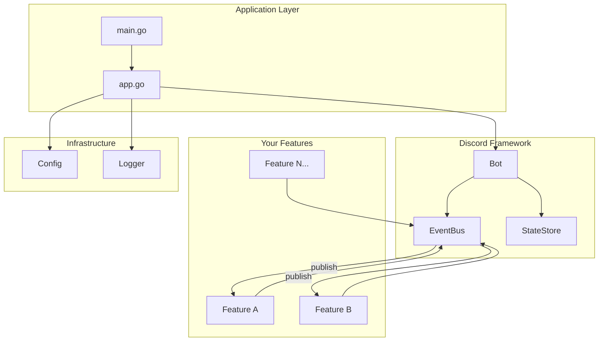
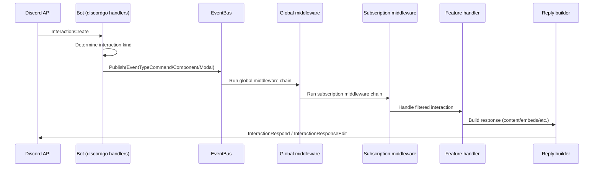

# dbot

A **Go boilerplate** for building Discord bots with [discordgo](https://github.com/bwmarrin/discordgo).

This template provides a batteries-included framework with an event bus, middleware system, reply builders, and hot-reloading configuration—so you can focus on building features instead of wiring up infrastructure.

## Features

- **Feature-based architecture** — Modular features with lifecycle hooks (`Init`, `Shutdown`)
- **Event bus** — Subscribe to Discord events with priority ordering
- **Middleware** — Chain reusable middleware for rate limiting, permissions, content filtering
- **Reply builder** — Fluent API for building responses with embeds, components, and attachments
- **Context wrappers** — Type-safe helpers for commands, messages, components, modals, reactions, and voice
- **Hot-reload config** — Viper-backed configuration with file watching
- **Structured logging** — Pluggable logger with slog/zap providers
- **Graceful shutdown** — Clean resource cleanup on `SIGINT`/`SIGTERM`

## Quick Start

### 1. Clone and rename

```bash
git clone https://github.com/JoshuaPangaribuan/dbot.git my-bot
cd my-bot

# Replace the module path with your own
find . -type f -name "*.go" -exec sed -i '' 's|github.com/JoshuaPangaribuan/dbot|github.com/yourusername/my-bot|g' {} +
sed -i '' 's|github.com/JoshuaPangaribuan/dbot|github.com/yourusername/my-bot|g' go.mod
```

### 2. Set your bot token

```bash
export DISCORD_TOKEN="your-bot-token"
```

### 3. Run

```bash
go run .
```

By default the app loads config from `opt/config/config.yaml`. Override with:

```bash
export DBOT_CONFIG_PATH="path/to/config.yaml"
```

### Sharding (large bots)

If your bot requires gateway sharding, enable it via config:

```yaml
discord:
  sharding:
    enabled: true
    auto: true
```

Or via env vars:

```bash
export DISCORD_SHARDING=true
export DISCORD_AUTO_SHARDING=true
```

### 4. Test in Discord

- `/level` — displays your current level and XP
- Send messages in a guild channel to earn XP and level up

The bot includes a levelling system that awards XP for messages and announces level-ups.

## Project Structure

```
.
├── main.go                     # Entry point
├── internal/
│   ├── app/                    # Application wiring & lifecycle
│   │   ├── app.go              # Bot initialization, signal handling
│   │   ├── config.go           # Config loader setup
│   │   └── log.go              # Logger setup
│   ├── features/               # Feature implementations
│   │   └── levelling/          # Example feature (XP/leveling system)
│   │       ├── feature.go      # Feature registration & lifecycle
│   │       ├── handlers/       # Discord event handlers
│   │       ├── service/        # Business logic (XP calculations)
│   │       └── persistence/    # Data persistence layer
│   └── pkg/
│       ├── discord/            # Discord bot framework
│       │   ├── bot.go          # Bot core, session management
│       │   ├── event.go        # Event bus & subscriptions
│       │   ├── feature.go      # Feature interface
│       │   ├── ctx.go          # Context wrappers
│       │   ├── command.go      # Command definitions
│       │   ├── state.go        # State management
│       │   ├── middleware/     # Built-in middleware
│       │   └── reply/          # Reply & embed builders
│       ├── config/             # Configuration abstraction
│       └── logger/             # Logging abstraction
├── internal/mocks/             # Auto-generated mocks
├── opt/config/config.yaml      # Configuration file
```

## Architecture



## Creating a Feature

Features are self-contained modules that subscribe to Discord events. Here's a minimal example:

```go
package myfeature

import (
    "context"
    "github.com/yourusername/my-bot/internal/pkg/discord"
    "github.com/bwmarrin/discordgo"
)

type Feature struct {
    bot    *discord.Bot
    logger Logger
}

// Dependencies defines what this feature needs
type Deps struct {
    Bot    *discord.Bot
    Logger Logger
}

// Register sets up the feature with dependency injection
func Register(deps Deps) {
    f := &Feature{
        bot:    deps.Bot,
        logger: deps.Logger,
    }

    // Subscribe to events
    for _, sub := range f.Subscriptions() {
        deps.Bot.EventBus().Subscribe(sub)
    }

    // Register commands
    if provider, ok := f.(*Feature); ok {
        cmds := provider.Commands()
        for _, cmd := range cmds {
            deps.Bot.SlashCommand(cmd.Name, cmd.Description, nil)
        }
    }

    // Register shutdown handler
    deps.Bot.RegisterShutdownHook(f.Shutdown)
}

func (f *Feature) Subscriptions() []*discord.Subscription {
    return []*discord.Subscription{
        {
            Type:    discord.EventTypeCommand,
            Handler: discord.CommandFilter("hello", f.handleHello),
        },
        {
            Type:       discord.EventTypeMessage,
            Handler:    f.handleMessage,
            Middleware: []discord.MiddlewareFunc{discord.IgnoreBot()},
        },
    }
}

func (f *Feature) Commands() []*discord.Command {
    return []*discord.Command{
        discord.NewSlashCommand("hello", "Says hello", nil),
    }
}

func (f *Feature) Shutdown(ctx context.Context) error {
    // Cleanup resources
    return nil
}

func (f *Feature) handleHello(ctx context.Context, e *discord.Event) error {
    ic := e.Data().(*discordgo.InteractionCreate)
    cmdCtx := discord.NewCommandContext(
        discord.NewContext(e, f.bot.State()),
        ic,
        nil,
    )
    _, err := cmdCtx.Reply().Content("Hello, world!").Send()
    return err
}

func (f *Feature) handleMessage(ctx context.Context, e *discord.Event) error {
    // Handle message events
    return nil
}
```

Register your feature in `internal/app/app.go`:

```go
myfeature.Register(myfeature.Deps{
    Bot:    bot,
    Logger: a.logger,
})
```

### CommandProvider Interface

If your feature provides slash commands, implement the optional `CommandProvider` interface:

```go
// Commands implements discord.CommandProvider
func (f *Feature) Commands() []*discord.Command {
    return []*discord.Command{
        discord.NewSlashCommand("greet", "Greets a user", nil).
            WithOptions(&discordgo.ApplicationCommandOption{
                Type:        discordgo.ApplicationCommandOptionUser,
                Name:        "user",
                Description: "User to greet",
                Required:    true,
            }),
    }
}
```

Commands are automatically synced with Discord when the bot opens.

## Event Types

Subscribe to these event types in your features:

| Event Type | Description | Data Type |
|------------|-------------|-----------|
| `EventTypeMessage` | New message created | `*discordgo.MessageCreate` |
| `EventTypeCommand` | Slash command invoked | `*discordgo.InteractionCreate` |
| `EventTypeComponent` | Button/select menu clicked | `*discordgo.InteractionCreate` |
| `EventTypeModal` | Modal form submitted | `*discordgo.InteractionCreate` |
| `EventTypeVoiceStateUpdate` | User joined/left/moved voice | `*discordgo.VoiceStateUpdate` |
| `EventTypeReactionAdd` | Reaction added | `*discordgo.MessageReactionAdd` |
| `EventTypeReactionRemove` | Reaction removed | `*discordgo.MessageReactionRemove` |

## Handling Interactions

This project treats Discord interactions (slash commands, components, modals) as first-class events on a single event bus.



### 1. Register slash commands

If a feature implements the optional `discord.CommandProvider` interface (`Commands() []*discord.Command`), those commands are collected during `bot.RegisterFeature(...)` and synced to Discord during `bot.Open()` using bulk overwrite.

### 2. Receive and route interactions

When Discord sends an `InteractionCreate` event, the bot:

1. Determines the interaction kind (`application command` / `message component` / `modal submit`)
2. Maps it to `EventTypeCommand` / `EventTypeComponent` / `EventTypeModal`
3. Publishes it to the `EventBus`

### 3. Apply middleware (global + per-handler)

The `EventBus` runs middleware in this order:

- Global middleware (configured once at startup)
- Subscription middleware (configured per handler)
- The handler itself

Global middleware is a good place for things like `discord.IgnoreBot()` and rate limiting.

### 4. Filter and handle the specific interaction

Features typically subscribe to `EventTypeCommand` and then filter by name:

- `discord.CommandFilter("echo", f.handleEcho)`
- `discord.ComponentFilter("my-button-id", f.handleClick)`

### 5. Reply using a context wrapper

Handlers can wrap the raw interaction in a typed context (e.g. `discord.NewCommandContext(...)`) and respond via the reply builder:

- `cmdCtx.Option("text").String()` to read command parameters
- `cmdCtx.Reply().Content("...").Ephemeral().Send()` to respond

## Built-in Middleware

All middleware returns `discord.MiddlewareFunc` for use with EventBus subscriptions.

### Core Middleware (discord package)

```go
import "github.com/yourusername/my-bot/internal/pkg/discord"

// Skip bot users
discord.IgnoreBot()

// Guild-only (no DMs)
discord.RequireGuild()

// Chain multiple middleware
discord.Chain(mw1, mw2, mw3)
```

### Additional Middleware (middleware package)

```go
import "github.com/yourusername/my-bot/internal/pkg/discord/middleware"

// Rate limit: 5 requests per 10 seconds per user (sliding window)
middleware.RateLimit(5, 10*time.Second)

// Require NSFW channel
middleware.RequireNSFW()

// Content filtering for messages
middleware.ContentFilterMiddleware(middleware.ContentFilterConfig{
    Filters: []middleware.ContentFilter{
        middleware.WordFilter("badword1", "badword2"),
        middleware.InviteFilter(),           // Block Discord invites
        middleware.LinkFilter(),             // Block all URLs
        middleware.MentionSpamFilter(5),     // Max 5 mentions
        middleware.CapsFilter(0.7, 10),      // 70% caps, min 10 chars
        middleware.RegexFilter(`\d{3,}`),    // Custom regex pattern
    },
    Action:  middleware.FilterActionWarn,    // or FilterActionDelete
    Message: "Your message was removed.",
})

// Event logging with duration tracking
middleware.EventLogger(logger)

// Permission check (hybrid config + Discord roles)
checker := middleware.NewHybridPermissionChecker(config)
middleware.RequireEventPermission(checker, "admin")
middleware.RequireAnyEventPermission(checker, "admin", "moderator")
```

### Using Middleware in Subscriptions

```go
func (f *Feature) Subscriptions() []*discord.Subscription {
    return []*discord.Subscription{
        {
            Type:    discord.EventTypeCommand,
            Handler: discord.CommandFilter("admin", f.handleAdmin),
            Middleware: []discord.MiddlewareFunc{
                discord.IgnoreBot(),
                middleware.RateLimit(3, time.Minute),
            },
        },
    }
}
```

## Configuration

Configuration is loaded from `opt/config/config.yaml` with environment variable overrides:

```yaml
host: localhost
port: 5555
discord:
  token: ""  # Override with DISCORD_TOKEN env var
```

The config system supports hot-reloading—changes to the file are picked up without restarting.

**Config providers:**
- **Viper Provider**: File watching with debouncing (100ms), supports YAML/JSON, thread-safe
- **OS Provider**: Simple key-value access without file watching

**Environment variables:**
- `DISCORD_TOKEN`: Discord bot token (overrides config)
- `DBOT_CONFIG_PATH`: Path to configuration file

## Logging

The framework provides pluggable logger providers with structured logging:

**Slog Provider** (default):
- Uses Go's standard `log/slog` with JSON output
- Custom field ordering: time, level, caller, message
- Automatic caller detection
- Context field injection capability

**Zap Provider** (high-performance):
- Uses `go.uber.org/zap` for production scenarios
- JSON encoding with production defaults
- Call stack support

```go
// In app.go
logger, err := logger.New(logger.ProviderSlog())
// or
logger, err := logger.New(logger.ProviderZap())
```

**Event Logging Middleware:**
- Event type tracking with custom field extraction
- User and channel information logging
- Command and interaction details
- Duration tracking for performance monitoring

## Development Tooling

The project includes comprehensive development tooling:

**Linting:**
- GolangCI-lint configured with essential linters
- Static analysis, unused code detection, error checking

**Testing:**
- Mockery for generating test mocks
- Comprehensive test suite with proper cleanup
- Benchmark support

**Build:**
- Makefile with build targets
- Static binary compilation (12MB)
- Cross-platform support

## Docker

Multi-stage build with caching and distroless runtime:

```bash
# Build (final image is distroless + nonroot)
DOCKER_BUILDKIT=1 docker build -t dbot .

# Run (recommended: provide token via env var)
docker run --rm \
  -e DISCORD_TOKEN="your-bot-token" \
  dbot

# Run tests in Docker
DOCKER_BUILDKIT=1 docker build --target test .
```

**Build stages:**
1. **Deps**: Downloads and caches Go dependencies (Alpine-based)
2. **Builder**: Compiles with optimizations and cache mounts
3. **Test**: Runs test suite in isolation
4. **Runtime**: Minimal distroless base with non-root user

## Discord Setup

1. Create an application at [Discord Developer Portal](https://discord.com/developers/applications)
2. Add a bot user and copy the token
3. Enable necessary intents for your features
4. Invite the bot with appropriate permissions (Send Messages, Use Slash Commands)

## License

MIT (or your preferred license)
