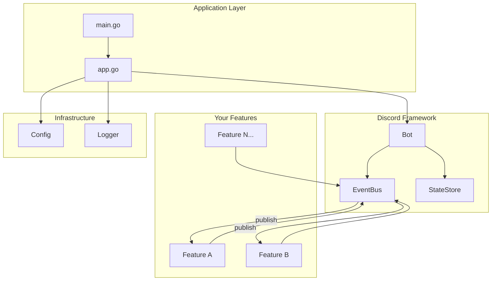
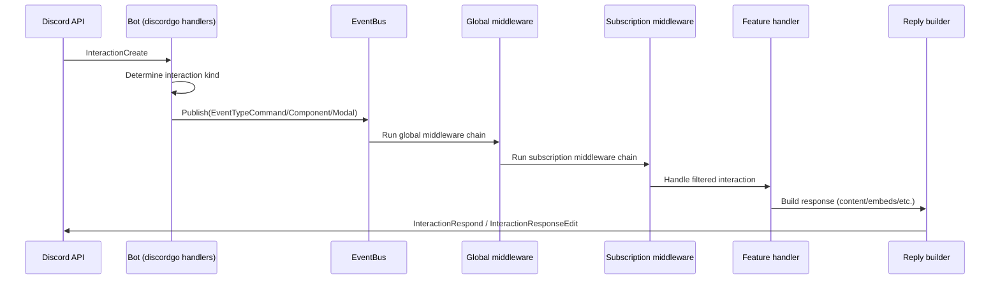

# dbot

[](https://go.dev/dl/)
[](LICENSE)
[](https://goreportcard.com/report/github.com/JoshuaPangaribuan/dbot)

A **Go boilerplate** for building Discord bots with [discordgo](https://github.com/bwmarrin/discordgo).

This template provides a batteries-included framework with an event bus, middleware system, reply builders, and hot-reloading configuration—so you can focus on building features instead of wiring up infrastructure.

## Features

- **Feature-based architecture** — Modular features with lifecycle hooks (`Init`, `Shutdown`)
- **Event bus** — Subscribe to Discord events with priority ordering
- **Middleware** — Chain reusable middleware for rate limiting, permissions, content filtering
- **Reply builder** — Fluent API for building responses with embeds, components, and attachments
- **Context wrappers** — Type-safe helpers for commands, messages, components, modals, reactions, and voice
- **Hot-reload config** — Viper-backed configuration with file watching
- **Structured logging** — Pluggable logger with slog/zap providers
- **Graceful shutdown** — Clean resource cleanup on `SIGINT`/`SIGTERM`
- **LangChain integration** — Built-in LLM support with OpenAI and Ollama providers, agent system, and RAG capabilities

## Table of Contents

- [Quick Start](#quick-start) - Get running in 3 minutes
- [Prerequisites](#prerequisites) - What you need before starting
- [System Requirements](#system-requirements) - Development and production requirements
- [Discord Setup](#discord-setup) - Configure your bot in Discord Developer Portal
- [Project Structure](#project-structure) - File organization overview
- [Creating Features](#creating-a-feature) - Building your first feature
- [Core Concepts](#core-concepts)
  - [Event System](#event-types) - Understanding Discord events
  - [Middleware](#built-in-middleware) - Reusable request processing
  - [Interactions](#handling-interactions) - Responding to users
- [Configuration](#configuration) - Setting up your bot
- [Logging](#logging) - Structured logging
- [LangChain Integration](#langchain-integration) - AI-powered features
- [Development Tooling](#development-tooling) - Testing, building, deployment
- [Docker Deployment](#docker) - Container setup
- [Troubleshooting](#troubleshooting) - Common issues and solutions
- [FAQ](#faq) - Frequently asked questions
- [Documentation](#documentation) - Deep-dive documentation

## Prerequisites

Before you begin, ensure you have:

- **Go 1.21 or higher** - [Install Go](https://go.dev/dl/)
- **Discord account** - Create one at [discord.com](https://discord.com)
- **Basic Go knowledge** - Understanding of functions, structs, and interfaces
- **Text editor or IDE** - VS Code, GoLand, or similar (VS Code with Go extension recommended)
- **Terminal** - For running commands and the bot

**Optional but recommended:**
- **Docker** - For containerized deployment ([Install Docker](https://docs.docker.com/get-docker/))
- **Git** - For version control ([Install Git](https://git-scm.com/downloads))

> **New to Go?** Check out [A Tour of Go](https://go.dev/tour/) and [Effective Go](https://go.dev/doc/effective_go) to get started.

## System Requirements

### Development
- **OS**: Windows 10+, macOS 11+, or Linux (Ubuntu 20.04+, Debian 11+, etc.)
- **RAM**: 2GB minimum, 4GB recommended
- **Disk**: 500MB for code + dependencies
- **Network**: Internet connection for Go module downloads and Discord API

### Production (Small Bots)
- **CPU**: 1 core
- **RAM**: 50-100MB per bot instance
- **Network**: Stable connection to Discord Gateway

### Production (Large Bots with Sharding)
- **CPU**: 2-4 cores (more shards = more CPU)
- **RAM**: ~100MB per shard
- **Network**: Low latency connection to Discord Gateway

### LangChain AI Features
- **API Access**: OpenAI/Ollama/Anthropic API access
- **Rate Limits**: Respect provider rate limits (OpenAI: ~3,000 RPM for tier 4)
- **Cost**: Monitor API usage - LLM calls can add up quickly

## Quick Start

### 1. Clone and Set Up

Clone the repository and navigate into it:

```bash
git clone https://github.com/JoshuaPangaribuan/dbot.git my-bot
cd my-bot
```

Update the module path in `go.mod`:
- Open `go.mod` in a text editor
- Replace `github.com/JoshuaPangaribuan/dbot` with your module path (e.g., `github.com/yourusername/my-bot`)

Update imports in all Go files:

**Linux/macOS:**
```bash
find . -type f -name "*.go" -exec sed -i '' 's|github.com/JoshuaPangaribuan/dbot|github.com/yourusername/my-bot|g' {} +
```

**Or use your editor's Find & Replace function:**
- Find: `github.com/JoshuaPangaribuan/dbot`
- Replace: `github.com/yourusername/my-bot`

### 2. Configure Your Bot

Set your bot token as an environment variable:

```bash
export DISCORD_TOKEN="your-bot-token-here"
```

> **Get your token:** See [Discord Setup](#discord-setup) below for detailed instructions on creating a bot and getting your token.

The app loads config from `opt/config/config.yaml` by default. You can override this with:

```bash
export DBOT_CONFIG_PATH="path/to/config.yaml"
```

### 3. Run the Bot

Start the bot:

```bash
go run .
```

You should see output indicating the bot is running and connected to Discord.

### 4. Test in Discord

Invite your bot to a server (see [Discord Setup](#discord-setup)) and try these commands:

- `/ask <prompt>` — Ask the AI a question
- `/level` — Check your XP and level
- `/play <url>` — Play audio (voice feature MVP)
- `/skip` — Skip current track
- `/queue` — Show playback queue
- Send messages in a guild channel to earn XP and level up

The bot includes:
- An **AI-powered ask feature** using LangChain integration
- A **levelling system** that awards XP for messages and announces level-ups
- A **voice/music feature** (MVP skeleton) with queue management

> **Note:** The voice feature is currently an MVP skeleton with simulated playback. Full audio streaming is not yet implemented.

### Sharding (Large Bots)

If your bot requires gateway sharding (2500+ guilds), enable it via config:

```yaml
discord:
  sharding:
    enabled: true
    auto: true
```

Or via env vars:

```bash
export DISCORD_SHARDING=true
export DISCORD_AUTO_SHARDING=true
```

## Project Structure

```
.
├── main.go                     # Entry point
├── internal/
│   ├── app/                    # Application wiring & lifecycle
│   │   ├── app.go              # Bot initialization, signal handling
│   │   ├── config.go           # Config loader setup
│   │   └── log.go              # Logger setup
│   ├── features/               # Feature implementations
│   │   ├── levelling/          # XP/leveling system
│   │   │   ├── feature.go      # Feature registration & lifecycle
│   │   │   ├── handlers/       # Discord event handlers
│   │   │   ├── service/        # Business logic (XP calculations)
│   │   │   └── persistence/    # Data persistence layer
│   │   ├── ask/                # AI-powered Q&A feature
│   │   │   ├── feature.go      # Feature registration & lifecycle
│   │   │   ├── handlers/       # Discord event handlers
│   │   │   ├── service/        # Business logic (LLM completion)
│   │   │   └── persistence/    # Data persistence layer
│   │   └── voice/              # Voice/music feature (MVP)
│   │       ├── feature.go      # Feature registration & lifecycle
│   │       ├── handlers/       # Discord command handlers
│   │       ├── service/        # Business logic (queue, playback)
│   │       └── persistence/    # State persistence layer
│   └── pkg/
│       ├── discord/            # Discord bot framework
│       │   ├── bot.go          # Bot core, session management
│       │   ├── event.go        # Event bus & subscriptions
│       │   ├── feature.go      # Feature interface
│       │   ├── ctx.go          # Context wrappers
│       │   ├── command.go      # Command definitions
│       │   ├── state.go        # State management
│       │   ├── middleware/     # Built-in middleware
│       │   └── reply/          # Reply & embed builders
│       ├── langchain/          # LLM integration
│       │   ├── service.go      # Core LLM service (OpenAI, Ollama)
│       │   ├── agent.go        # Agent with tool support
│       │   ├── rag.go          # Retrieval-augmented generation
│       │   ├── memory.go       # Conversation memory
│       │   └── providers.go    # LLM provider implementations
│       ├── config/             # Configuration abstraction
│       └── logger/             # Logging abstraction
├── internal/mocks/             # Auto-generated mocks
├── opt/config/config.yaml      # Configuration file
```

## Architecture



## Creating a Feature

Features are self-contained modules that subscribe to Discord events. Here's a minimal example:

```go
package myfeature

import (
    "context"
    "github.com/yourusername/my-bot/internal/pkg/discord"
    "github.com/bwmarrin/discordgo"
)

type Feature struct {
    bot    *discord.Bot
    logger Logger
}

// Dependencies defines what this feature needs
type Deps struct {
    Bot    *discord.Bot
    Logger Logger
}

// Register sets up the feature with dependency injection
func Register(deps Deps) {
    f := &Feature{
        bot:    deps.Bot,
        logger: deps.Logger,
    }

    // Subscribe to events
    for _, sub := range f.Subscriptions() {
        deps.Bot.EventBus().Subscribe(sub)
    }

    // Register commands
    if provider, ok := f.(*Feature); ok {
        cmds := provider.Commands()
        for _, cmd := range cmds {
            deps.Bot.SlashCommand(cmd.Name, cmd.Description, nil)
        }
    }

    // Register shutdown handler
    deps.Bot.RegisterShutdownHook(f.Shutdown)
}

func (f *Feature) Subscriptions() []*discord.Subscription {
    return []*discord.Subscription{
        {
            Type:    discord.EventTypeCommand,
            Handler: discord.CommandFilter("hello", f.handleHello),
        },
        {
            Type:       discord.EventTypeMessage,
            Handler:    f.handleMessage,
            Middleware: []discord.MiddlewareFunc{discord.IgnoreBot()},
        },
    }
}

func (f *Feature) Commands() []*discord.Command {
    return []*discord.Command{
        discord.NewSlashCommand("hello", "Says hello", nil),
    }
}

func (f *Feature) Shutdown(ctx context.Context) error {
    // Cleanup resources
    return nil
}

func (f *Feature) handleHello(ctx context.Context, e *discord.Event) error {
    ic := e.Data().(*discordgo.InteractionCreate)
    cmdCtx := discord.NewCommandContext(
        discord.NewContext(e, f.bot.State()),
        ic,
        nil,
    )
    _, err := cmdCtx.Reply().Content("Hello, world!").Send()
    return err
}

func (f *Feature) handleMessage(ctx context.Context, e *discord.Event) error {
    // Handle message events
    return nil
}
```

Register your feature in `internal/app/app.go`:

```go
myfeature.Register(myfeature.Deps{
    Bot:    bot,
    Logger: a.logger,
})
```

### CommandProvider Interface

If your feature provides slash commands, implement the optional `CommandProvider` interface:

```go
// Commands implements discord.CommandProvider
func (f *Feature) Commands() []*discord.Command {
    return []*discord.Command{
        discord.NewSlashCommand("greet", "Greets a user", nil).
            WithOptions(&discordgo.ApplicationCommandOption{
                Type:        discordgo.ApplicationCommandOptionUser,
                Name:        "user",
                Description: "User to greet",
                Required:    true,
            }),
    }
}
```

Commands are automatically synced with Discord when the bot opens.

### Feature Structure Pattern

Features follow a consistent three-layer architecture:

```
myfeature/
├── feature.go      # Registration, lifecycle, dependencies
├── handlers/       # Discord event handlers (thin layer)
├── service/        # Business logic (domain logic)
└── persistence/    # Data persistence layer (storage)
```

**Separation of concerns:**
- **feature.go**: Wires dependencies, implements `Register()`, handles lifecycle
- **handlers/**: Converts Discord events to service calls, handles reply formatting
- **service/**: Contains domain logic, independent of Discord
- **persistence/**: Handles data storage, independent of both Discord and service logic

This pattern keeps features testable and maintains clear boundaries between Discord handling, business logic, and data storage.

## Event Types

Subscribe to these event types in your features:

| Event Type | Description | Data Type | Use Cases |
|------------|-------------|-----------|-----------|
| `EventTypeMessage` | New message created | `*discordgo.MessageCreate` | Chat commands, message logging, auto-moderation |
| `EventTypeCommand` | Slash command invoked | `*discordgo.InteractionCreate` | Bot commands, user interactions |
| `EventTypeComponent` | Button/select menu clicked | `*discordgo.InteractionCreate` | Interactive UI, confirmations |
| `EventTypeModal` | Modal form submitted | `*discordgo.InteractionCreate` | Multi-step forms, data collection |
| `EventTypeVoiceStateUpdate` | User joined/left/moved voice | `*discordgo.VoiceStateUpdate` | Voice tracking, auto-roles |
| `EventTypeReactionAdd` | Reaction added | `*discordgo.MessageReactionAdd` | Reaction roles, polls |
| `EventTypeReactionRemove` | Reaction removed | `*discordgo.MessageReactionRemove` | Poll updates, reaction cleanup |

## Handling Interactions

This project treats Discord interactions (slash commands, components, modals) as first-class events on a single event bus.



### 1. Register slash commands

If a feature implements the optional `discord.CommandProvider` interface (`Commands() []*discord.Command`), those commands are collected during `bot.RegisterFeature(...)` and synced to Discord during `bot.Open()` using bulk overwrite.

### 2. Receive and route interactions

When Discord sends an `InteractionCreate` event, the bot:

1. Determines the interaction kind (`application command` / `message component` / `modal submit`)
2. Maps it to `EventTypeCommand` / `EventTypeComponent` / `EventTypeModal`
3. Publishes it to the `EventBus`

### 3. Apply middleware (global + per-handler)

The `EventBus` runs middleware in this order:

- Global middleware (configured once at startup)
- Subscription middleware (configured per handler)
- The handler itself

Global middleware is a good place for things like `discord.IgnoreBot()` and rate limiting.

### 4. Filter and handle the specific interaction

Features typically subscribe to `EventTypeCommand` and then filter by name:

- `discord.CommandFilter("echo", f.handleEcho)`
- `discord.ComponentFilter("my-button-id", f.handleClick)`

### 5. Reply using a context wrapper

Handlers can wrap the raw interaction in a typed context (e.g. `discord.NewCommandContext(...)`) and respond via the reply builder:

- `cmdCtx.Option("text").String()` to read command parameters
- `cmdCtx.Reply().Content("...").Ephemeral().Send()` to respond

## Built-in Middleware

All middleware returns `discord.MiddlewareFunc` for use with EventBus subscriptions.

### Core Middleware (discord package)

```go
import "github.com/yourusername/my-bot/internal/pkg/discord"

// Skip bot users
discord.IgnoreBot()

// Guild-only (no DMs)
discord.RequireGuild()

// Chain multiple middleware
discord.Chain(mw1, mw2, mw3)
```

### Additional Middleware (middleware package)

```go
import "github.com/yourusername/my-bot/internal/pkg/discord/middleware"

// Rate limit: 5 requests per 10 seconds per user (sliding window)
middleware.RateLimit(5, 10*time.Second)

// Require NSFW channel
middleware.RequireNSFW()

// Content filtering for messages
middleware.ContentFilterMiddleware(middleware.ContentFilterConfig{
    Filters: []middleware.ContentFilter{
        middleware.WordFilter("badword1", "badword2"),
        middleware.InviteFilter(),           // Block Discord invites
        middleware.LinkFilter(),             // Block all URLs
        middleware.MentionSpamFilter(5),     // Max 5 mentions
        middleware.CapsFilter(0.7, 10),      // 70% caps, min 10 chars
        middleware.RegexFilter(`\d{3,}`),    // Custom regex pattern
    },
    Action:  middleware.FilterActionWarn,    // or FilterActionDelete
    Message: "Your message was removed.",
})

// Event logging with duration tracking
middleware.EventLogger(logger)

// Permission check (hybrid config + Discord roles)
checker := middleware.NewHybridPermissionChecker(config)
middleware.RequireEventPermission(checker, "admin")
middleware.RequireAnyEventPermission(checker, "admin", "moderator")
```

### Using Middleware in Subscriptions

```go
func (f *Feature) Subscriptions() []*discord.Subscription {
    return []*discord.Subscription{
        {
            Type:    discord.EventTypeCommand,
            Handler: discord.CommandFilter("admin", f.handleAdmin),
            Middleware: []discord.MiddlewareFunc{
                discord.IgnoreBot(),
                middleware.RateLimit(3, time.Minute),
            },
        },
    }
}
```

## Configuration

Configuration is loaded from `opt/config/config.yaml` with environment variable overrides:

```yaml
host: localhost
port: 5555
discord:
  token: ""  # Override with DISCORD_TOKEN env var
```

The config system supports hot-reloading—changes to the file are picked up without restarting.

**Config providers:**
- **Viper Provider**: File watching with debouncing (100ms), supports YAML/JSON, thread-safe
- **OS Provider**: Simple key-value access without file watching

**Environment variables:**
- `DISCORD_TOKEN`: Discord bot token (overrides config)
- `DBOT_CONFIG_PATH`: Path to configuration file

## Logging

The framework provides pluggable logger providers with structured logging:

**Slog Provider** (default):
- Uses Go's standard `log/slog` with JSON output
- Custom field ordering: time, level, caller, message
- Automatic caller detection
- Context field injection capability

**Zap Provider** (high-performance):
- Uses `go.uber.org/zap` for production scenarios
- JSON encoding with production defaults
- Call stack support

```go
// In app.go
logger, err := logger.New(logger.ProviderSlog())
// or
logger, err := logger.New(logger.ProviderZap())
```

**Event Logging Middleware:**
- Event type tracking with custom field extraction
- User and channel information logging
- Command and interaction details
- Duration tracking for performance monitoring

## LangChain Integration

The framework includes a comprehensive LangChain integration for building AI-powered Discord bots:

### Supported LLM Providers

**OpenAI:**
```go
svc, err := langchain.New(
    langchain.WithProvider(langchain.ProviderOpenAI),
    langchain.WithOpenAIConfig("sk-...", "https://api.openai.com/v1"),
    langchain.WithModel("gpt-4"),
    langchain.WithTemperature(0.7),
)
```

**Ollama (local):**
```go
svc, err := langchain.New(
    langchain.WithProvider(langchain.ProviderOllama),
    langchain.WithOllamaConfig("http://localhost:11434"),
    langchain.WithModel("llama2"),
)
```

**Anthropic:**
```go
svc, err := langchain.New(
    langchain.WithProvider(langchain.ProviderAnthropic),
    langchain.WithAnthropicConfig("sk-ant-...", "https://api.anthropic.com"),
    langchain.WithModel("claude-3-haiku-20240307"),
)
```

### Text Completion

```go
result, err := svc.Complete(ctx, "What is the capital of France?")
```

### Chat with History

```go
messages := []langchain.Message{
    {Role: "system", Content: "You are a helpful assistant"},
    {Role: "user", Content: "Hello!"},
    {Role: "assistant", Content: "Hi there!"},
    {Role: "user", Content: "How are you?"},
}
result, err := svc.Chat(ctx, messages)
```

### Streaming Completion

```go
// Stream tokens as they arrive
ch, err := svc.Stream(ctx, "Tell me a story")
for token := range ch {
    fmt.Print(token) // Handle each token as it arrives
}
```

### Agent with Tools

Create agents that can use tools:

```go
// Define a tool
weatherTool := langchain.NewSimpleTool("weather", "Get weather information",
    func(ctx context.Context, location string) (string, error) {
        return fmt.Sprintf("Weather in %s: Sunny, 72°F", location), nil
    },
)

// Create agent with tools
agent := langchain.NewAgent(svc, weatherTool)

// Run agent (will decide which tool to use)
response, err := agent.Run(ctx, "What's the weather in Paris?")
```

### RAG (Retrieval-Augmented Generation)

Add knowledge retrieval to your bot:

```go
// Create a vector store
store := langchain.NewSimpleVectorStore()

// Create RAG service
ragSvc := langchain.NewRAGService(svc, store)

// Add documents
err := ragSvc.AddDocuments(ctx, []string{
    "Paris is the capital of France.",
    "London is the capital of the UK.",
}, nil)

// Query with RAG
answer, err := ragSvc.Query(ctx, "What is the capital of France?", 2)
```

### Configuration Options

```go
langchain.WithModel("gpt-4")              // Model name
langchain.WithTemperature(0.5)            // Response randomness (0-1)
langchain.WithMaxTokens(1000)             // Max response length
langchain.WithTimeout(30 * time.Second)   // Request timeout
langchain.WithLogger(logger)              // Custom logger
langchain.WithSystemPrompt("You are...")  // System prompt for chat
```

## Development Tooling

The project includes comprehensive development tooling:

**Linting:**
- GolangCI-lint configured with essential linters
- Static analysis, unused code detection, error checking

**Testing:**
- Mockery for generating test mocks
- Comprehensive test suite with proper cleanup
- Benchmark support

**Build:**
- Makefile with build targets
- Static binary compilation (12MB)
- Cross-platform support

## Docker

Multi-stage build with caching and distroless runtime:

```bash
# Build (final image is distroless + nonroot)
DOCKER_BUILDKIT=1 docker build -t dbot .

# Run (recommended: provide token via env var)
docker run --rm \
  -e DISCORD_TOKEN="your-bot-token" \
  dbot

# Run tests in Docker
DOCKER_BUILDKIT=1 docker build --target test .
```

**Build stages:**
1. **Deps**: Downloads and caches Go dependencies (Alpine-based)
2. **Builder**: Compiles with optimizations and cache mounts
3. **Test**: Runs test suite in isolation
4. **Runtime**: Minimal distroless base with non-root user

## Discord Setup

### Step 1: Create a Discord Application

1. Go to the [Discord Developer Portal](https://discord.com/developers/applications)
2. Click **"New Application"**
3. Give your application a name (e.g., "My Awesome Bot")
4. Click **"Create"**

### Step 2: Create a Bot User

1. In the left sidebar, click **"Bot"**
2. Click **"Add Bot"**
3. Confirm by clicking **"Yes, do it!"**
4. Under **"Privileged Gateway Intents"**, enable:
   - ✅ **Message Content Intent** (required for message handling)
   - ✅ **Server Members Intent** (if using member features)
   - ✅ **Presence Intent** (if tracking user status)
5. Click **"Reset Token"** to generate a new token
6. **Copy the token immediately** (you won't see it again!)
7. Save it securely: `export DISCORD_TOKEN="paste-token-here"`

> ⚠️ **Important**: Never commit your bot token to version control! Always use environment variables.

### Step 3: Configure OAuth2 URL (Invite Bot)

1. In the left sidebar, click **"OAuth2"** → **"URL Generator"**
2. Under **"Scopes"**, select:
   - ✅ **bot**
   - ✅ **applications.commands** (for slash commands)
3. Under **"Bot Permissions"**, select:
   - ✅ **Send Messages**
   - ✅ **Embed Links**
   - ✅ **Attach Files**
   - ✅ **Add Reactions**
   - ✅ **Use Slash Commands**
   - ✅ **Connect** (for voice features)
   - ✅ **Speak** (for voice features)
   - ✅ **Read Message History**
4. Copy the generated URL from the bottom
5. Paste it into your browser and invite the bot to your server

### Step 4: Get Your Server ID (Optional but Recommended)

For instant command updates during development:

1. Open Discord
2. Go to **User Settings** → **Advanced**
3. Enable **Developer Mode**
4. Right-click your server icon
5. Select **"Copy Server ID"**
6. Add it to `opt/config/config.yaml`:
   ```yaml
   discord:
     guild_id: "paste-server-id-here"
   ```

### Common Issues

| Problem | Solution |
|---------|----------|
| Commands don't appear | Wait up to 1 hour for global commands, or set `guild_id` for instant updates |
| "Invalid Intent" error | Enable the required intents in Discord Developer Portal → Bot → Privileged Gateway Intents |
| Bot can't read messages | Enable **Message Content Intent** |
| Bot can't join voice | Enable **Connect** and **Speak** permissions in OAuth2 scopes |

## Troubleshooting

### Bot won't start

**Error: `Invalid token`**
- Verify you copied the correct token from Discord Developer Portal
- Ensure there are no extra spaces: `export DISCORD_TOKEN="your-token"` (no spaces around token)
- Check that you haven't accidentally committed the token to version control

**Error: `Permission denied`**
- Check that the bot has permission to read/write in the test server
- Verify intents are enabled in Discord Developer Portal

**Error: `Cannot find module`**
- Run `go mod tidy` to ensure dependencies are properly installed
- Check your Go version is 1.21 or higher

### Commands not appearing

**Commands don't show up in Discord**
- Commands can take up to 1 hour to propagate globally
- For instant updates, set `guild_id` in config to your test server ID
- Run the bot again after updating the config
- Check that the bot has the `applications.commands` scope in the invite URL

**Error: `Unknown command`**
- Wait 30-60 seconds for commands to sync
- Check the bot has the `applications.commands` scope
- Verify the bot is actually running and connected

### LangChain errors

**Error: `API key invalid`**
- Verify your API key is correct for the chosen provider
- Check that `base_url` is correct (default: OpenAI API)
- Ensure you have available API credits/quota
- For Ollama, verify the service is running: `curl http://localhost:11434`

**Error: `Context deadline exceeded`**
- The LLM request took too long to respond
- Increase timeout in config: `langchain.timeout: 60s`
- Check your network connection to the API

### Voice feature issues

**Bot joins but no audio plays**
- The voice feature is currently an MVP skeleton with simulated playback
- Audio streaming is not yet implemented
- The queue management and structure are ready for future implementation

**Bot won't join voice channel**
- Check that the bot has **Connect** and **Speak** permissions
- Verify the voice feature is enabled in config: `voice.enabled: true`
- Ensure you're in a voice channel the bot can access

### Still stuck?

- Check the logs: The bot outputs detailed error messages
- Enable debug logging by setting `LOG_LEVEL=debug`
- Open an issue on [GitHub](https://github.com/JoshuaPangaribuan/dbot/issues)

## FAQ

### General

**Q: Can I host this on free hosting platforms?**
A: Yes! The bot compiles to a single static binary (~12MB) and works on:
- **Railway**, **Render**, **Fly.io** (recommended)
- **Heroku** (with buildpacks)
- **VPS** (DigitalOcean, Linode, AWS, etc.)

**Q: Does this support Discord's new Interactions?**
A: Yes! Full support for slash commands, buttons, select menus, and modals.

**Q: Can I use this with an existing discordgo bot?**
A: This framework is built on discordgo, so you can integrate pieces. However, it's designed to be a complete replacement for discordgo's session handling.

### Development

**Q: How do I add persistent storage?**
A: Use any Go database library (sqlx, gorm, etc.) in your feature's `Init()` method. Remember to close connections in `Shutdown()`.

**Q: Can I use web frameworks (Gin, Echo, etc.)?**
A: Yes! Start an HTTP server in `Init()` to add a web dashboard, webhook endpoints, or API.

**Q: How do I deploy multiple instances?**
A: For stateless features, just deploy multiple copies. For stateful features, use Redis, PostgreSQL, or another external store.

### LangChain

**Q: Do I need an API key for LangChain?**
A: Yes, unless you use Ollama (local LLM). Each provider (OpenAI, Anthropic) requires their own API key.

**Q: Can I use custom LLMs?**
A: Yes! Use the "openai" provider with a custom `base_url` to point to any OpenAI-compatible API.

**Q: How much does LangChain cost?**
A: It depends on the provider and model. For example:
- **OpenAI GPT-4o-mini**: ~$0.15 per 1M input tokens
- **Ollama (local)**: Free (runs on your hardware)
Monitor your usage and set budget limits!

### Sharding

**Q: When should I enable sharding?**
A: Discord requires sharding when you reach 2500 guilds. Enable it before hitting that limit.

**Q: Does sharding cost more?**
A: Yes, each shard uses a Discord gateway connection. Consider:
- **1 shard**: ~50MB RAM
- **10 shards**: ~500MB RAM
- **100 shards**: ~5GB RAM

**Q: Can I run shards on multiple servers?**
A: Not currently. This framework runs all shards in one process. For distributed sharding, consider using a process manager.

## Documentation

**Framework Documentation:**
- [Discord Framework README](internal/pkg/discord/README.md) — Complete API reference and component documentation

**Quick Reference:**
- See [Creating a Feature](#creating-a-feature) for feature development
- See [Built-in Middleware](#built-in-middleware) for middleware examples
- See [LangChain Integration](#langchain-integration) for AI features
- See [Configuration](#configuration) for setup options

**Coming Soon:**
- Voice feature deep-dive guide
- Architecture patterns and best practices
- Migration guide from discordgo

## Community & Support

**Getting Help:**
- 📖 [Documentation](#documentation) - Start here!
- 🐛 [GitHub Issues](https://github.com/JoshuaPangaribuan/dbot/issues) - Bug reports and feature requests
- 💬 [Discord Community](https://discord.gg/) - Chat with other users

**Contributing:**
Contributions are welcome! Feel free to:
- Report bugs and feature requests
- Submit pull requests
- Improve documentation
- Share your projects built with dbot

**Related Projects:**
- [discordgo](https://github.com/bwmarrin/discordgo) - underlying Discord library
- [LangChain Go](https://github.com/tmc/langchaingo) - LLM integration

## License

MIT © 2024 Joshua Pangaribuan

This project is open source and available under the [MIT License](LICENSE).
