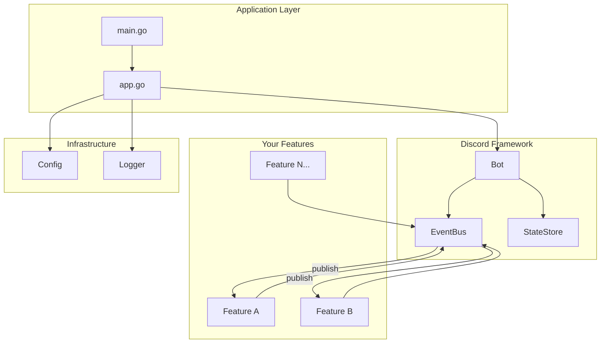
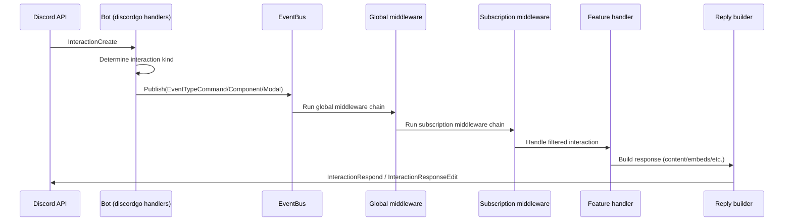

# dbot

A **Go boilerplate** for building Discord bots with [discordgo](https://github.com/bwmarrin/discordgo).

This template provides a batteries-included framework with an event bus, middleware system, reply builders, and hot-reloading configuration—so you can focus on building features instead of wiring up infrastructure.

## Features

- **Feature-based architecture** — Modular features with lifecycle hooks (`Init`, `Shutdown`)
- **Event bus** — Subscribe to Discord events with priority ordering
- **Middleware** — Chain reusable middleware for rate limiting, permissions, content filtering
- **Reply builder** — Fluent API for building responses with embeds, components, and attachments
- **Context wrappers** — Type-safe helpers for commands, messages, components, modals, reactions, and voice
- **Hot-reload config** — Viper-backed configuration with file watching
- **Structured logging** — Pluggable logger with slog/zap providers
- **Graceful shutdown** — Clean resource cleanup on `SIGINT`/`SIGTERM`

## Quick Start

### 1. Clone and rename

```bash
git clone https://github.com/JoshuaPangaribuan/dbot.git my-bot
cd my-bot

# Replace the module path with your own
find . -type f -name "*.go" -exec sed -i '' 's|github.com/JoshuaPangaribuan/dbot|github.com/yourusername/my-bot|g' {} +
sed -i '' 's|github.com/JoshuaPangaribuan/dbot|github.com/yourusername/my-bot|g' go.mod
```

### 2. Set your bot token

```bash
export DISCORD_TOKEN="your-bot-token"
```

### 3. Run

```bash
go run .
```

By default the app loads config from `opt/config/db.yaml`. Override with:

```bash
export DBOT_CONFIG_PATH="opt/config/db.local.yaml"
```

### 4. Test in Discord

- `/ping` — replies with "pong"
- `/echo text: hello` → bot replies `hello` to the channel
- `!echo hello` — echoes "hello" back (message example)
- Any message in a guild channel → bot reacts with `👍` (thumbs up example)

## Docker

Build (final image is distroless + nonroot):

```bash
DOCKER_BUILDKIT=1 docker build -t dbot .
```

Run (recommended: provide token via env var, not config file):

```bash
docker run --rm \
  -e DISCORD_TOKEN="your-bot-token" \
  dbot
```

Optional: run tests in Docker:

```bash
DOCKER_BUILDKIT=1 docker build --target test .
```

## Project Structure

```
.
├── main.go                     # Entry point
├── internal/
│   ├── app/                    # Application wiring & lifecycle
│   │   ├── app.go              # Bot initialization, signal handling
│   │   ├── config.go           # Config loader setup
│   │   └── log.go              # Logger setup
│   ├── echo/                   # Example feature (slash command with params)
│   ├── pingpong/               # Example feature (remove or rename)
│   │   ├── feature.go          # Feature implementation
│   │   ├── module.go           # Legacy module (for reference)
│   │   ├── service/            # Business logic
│   │   └── handlers/           # Legacy handlers (for reference)
│   ├── thumbsup/               # Example feature (reacts 👍 to every message)
│   │   └── feature.go          # Feature implementation
│   └── pkg/
│       ├── discord/            # Discord bot framework
│       │   ├── bot.go          # Bot core, session management
│       │   ├── event.go        # Event bus & subscriptions
│       │   ├── feature.go      # Feature interface
│       │   ├── ctx.go          # Context wrappers
│       │   ├── command.go      # Command definitions
│       │   ├── mw.go           # Core middleware (IgnoreBot, RequireGuild)
│       │   ├── reply/          # Reply & embed builders
│       │   └── middleware/     # Built-in middleware
│       ├── config/             # Configuration abstraction
│       └── logger/             # Logging abstraction
└── opt/config/db.yaml          # Sample config file
```

## Architecture



## Creating a Feature

Features are self-contained modules that subscribe to Discord events. Here's a minimal example:

```go
package myfeature

import (
    "context"
    "github.com/yourusername/my-bot/internal/pkg/discord"
    "github.com/bwmarrin/discordgo"
)

type Feature struct {
    bot *discord.Bot
}

func New() *Feature {
    return &Feature{}
}

func (f *Feature) Name() string { return "myfeature" }

func (f *Feature) Init(b *discord.Bot) error {
    f.bot = b
    return nil
}

func (f *Feature) Shutdown(ctx context.Context) error {
    return nil
}

// Subscriptions returns event handlers for this feature.
func (f *Feature) Subscriptions() []*discord.Subscription {
    return []*discord.Subscription{
        {
            Type:    discord.EventTypeCommand,
            Handler: discord.CommandFilter("hello", f.handleHello),
        },
        {
            Type:       discord.EventTypeMessage,
            Handler:    f.handleMessage,
            Middleware: []discord.MiddlewareFunc{discord.IgnoreBot()},
        },
    }
}

// Commands implements discord.CommandProvider to register slash commands.
// This is optional - only needed if your feature defines slash commands.
func (f *Feature) Commands() []*discord.Command {
    return []*discord.Command{
        discord.NewSlashCommand("hello", "Says hello", nil),
    }
}

func (f *Feature) handleHello(ctx context.Context, e *discord.Event) error {
    ic := e.Data().(*discordgo.InteractionCreate)
    cmdCtx := discord.NewCommandContext(
        discord.NewContext(e, f.bot.State()),
        ic,
        nil,
    )
    _, err := cmdCtx.Reply().Content("Hello, world!").Send()
    return err
}

func (f *Feature) handleMessage(ctx context.Context, e *discord.Event) error {
    // Handle message events
    return nil
}
```

Register your feature in `internal/app/app.go`:

```go
myFeature := myfeature.New()
if err := bot.RegisterFeature(myFeature); err != nil {
    panic(err)
}
```

### CommandProvider Interface

If your feature provides slash commands, implement the optional `CommandProvider` interface:

```go
// Commands implements discord.CommandProvider
func (f *Feature) Commands() []*discord.Command {
    return []*discord.Command{
        discord.NewSlashCommand("greet", "Greets a user", nil).
            WithOptions(&discordgo.ApplicationCommandOption{
                Type:        discordgo.ApplicationCommandOptionUser,
                Name:        "user",
                Description: "User to greet",
                Required:    true,
            }),
    }
}
```

Commands are automatically synced with Discord when the bot opens.

## Event Types

Subscribe to these event types in your features:

| Event Type | Description | Data Type |
|------------|-------------|-----------|
| `EventTypeMessage` | New message created | `*discordgo.MessageCreate` |
| `EventTypeCommand` | Slash command invoked | `*discordgo.InteractionCreate` |
| `EventTypeComponent` | Button/select menu clicked | `*discordgo.InteractionCreate` |
| `EventTypeModal` | Modal form submitted | `*discordgo.InteractionCreate` |
| `EventTypeVoiceStateUpdate` | User joined/left/moved voice | `*discordgo.VoiceStateUpdate` |
| `EventTypeReactionAdd` | Reaction added | `*discordgo.MessageReactionAdd` |
| `EventTypeReactionRemove` | Reaction removed | `*discordgo.MessageReactionRemove` |

## Handling Interactions

This project treats Discord interactions (slash commands, components, modals) as first-class events on a single event bus.



### 1. Register slash commands

If a feature implements the optional `discord.CommandProvider` interface (`Commands() []*discord.Command`), those commands are collected during `bot.RegisterFeature(...)` and synced to Discord during `bot.Open()` using bulk overwrite.

### 2. Receive and route interactions

When Discord sends an `InteractionCreate` event, the bot:

1. Determines the interaction kind (`application command` / `message component` / `modal submit`)
2. Maps it to `EventTypeCommand` / `EventTypeComponent` / `EventTypeModal`
3. Publishes it to the `EventBus`

### 3. Apply middleware (global + per-handler)

The `EventBus` runs middleware in this order:

- Global middleware (configured once at startup)
- Subscription middleware (configured per handler)
- The handler itself

Global middleware is a good place for things like `discord.IgnoreBot()` and rate limiting.

### 4. Filter and handle the specific interaction

Features typically subscribe to `EventTypeCommand` and then filter by name:

- `discord.CommandFilter("echo", f.handleEcho)`
- `discord.ComponentFilter("my-button-id", f.handleClick)`

### 5. Reply using a context wrapper

Handlers can wrap the raw interaction in a typed context (e.g. `discord.NewCommandContext(...)`) and respond via the reply builder:

- `cmdCtx.Option("text").String()` to read command parameters
- `cmdCtx.Reply().Content("...").Ephemeral().Send()` to respond

## Built-in Middleware

All middleware returns `discord.MiddlewareFunc` for use with EventBus subscriptions.

### Core Middleware (discord package)

```go
import "github.com/yourusername/my-bot/internal/pkg/discord"

// Skip bot users
discord.IgnoreBot()

// Guild-only (no DMs)
discord.RequireGuild()

// Chain multiple middleware
discord.Chain(mw1, mw2, mw3)
```

### Additional Middleware (middleware package)

```go
import "github.com/yourusername/my-bot/internal/pkg/discord/middleware"

// Rate limit: 5 requests per 10 seconds per user
middleware.RateLimit(5, 10*time.Second)

// Require NSFW channel
middleware.RequireNSFW()

// Content filtering for messages
middleware.ContentFilterMiddleware(middleware.ContentFilterConfig{
    Filters: []middleware.ContentFilter{
        middleware.WordFilter("badword1", "badword2"),
        middleware.InviteFilter(),
    },
    Action:  middleware.FilterActionWarn,
    Message: "Your message was removed.",
})

// Event logging
middleware.EventLogger(logger)

// Permission check (requires EventPermissionChecker implementation)
middleware.RequireEventPermission(checker, "admin")
```

### Using Middleware in Subscriptions

```go
func (f *Feature) Subscriptions() []*discord.Subscription {
    return []*discord.Subscription{
        {
            Type:    discord.EventTypeCommand,
            Handler: discord.CommandFilter("admin", f.handleAdmin),
            Middleware: []discord.MiddlewareFunc{
                discord.IgnoreBot(),
                middleware.RateLimit(3, time.Minute),
            },
        },
    }
}
```

## Configuration

Configuration is loaded from `opt/config/db.yaml` with environment variable overrides:

```yaml
host: localhost
port: 5555
discord:
  token: ""  # Override with DISCORD_TOKEN env var
```

The config system supports hot-reloading—changes to the file are picked up without restarting.

## Discord Setup

1. Create an application at [Discord Developer Portal](https://discord.com/developers/applications)
2. Add a bot user and copy the token
3. Enable **Message Content Intent** (required for `!echo` style commands)
4. Invite the bot with appropriate permissions (Send Messages, Use Slash Commands)

## License

MIT (or your preferred license)
