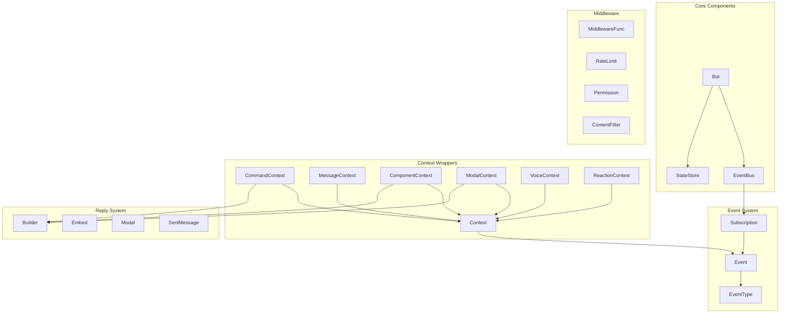
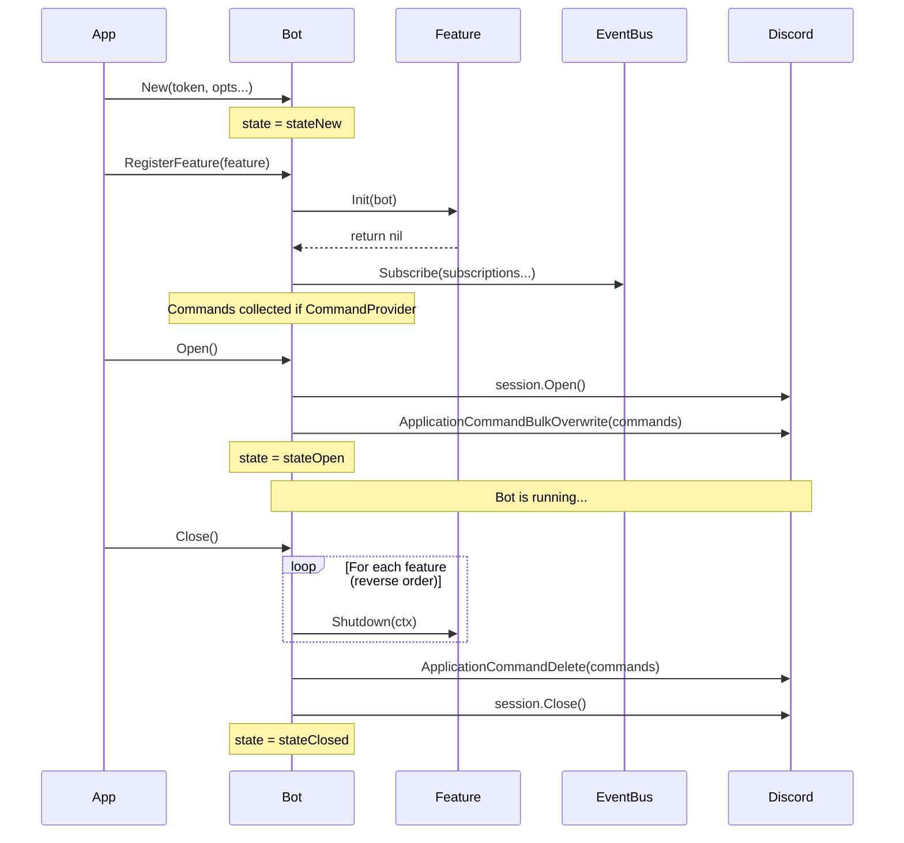
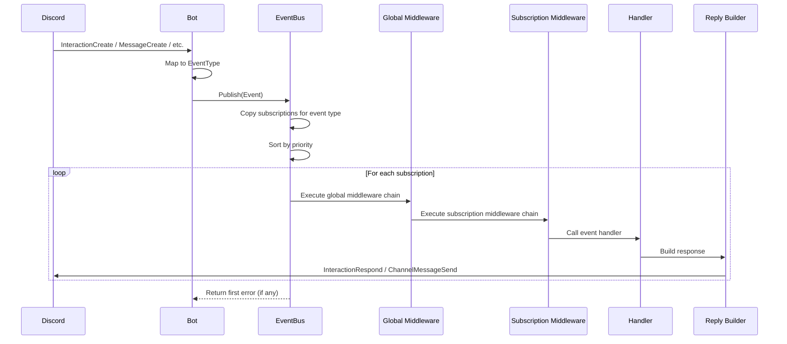
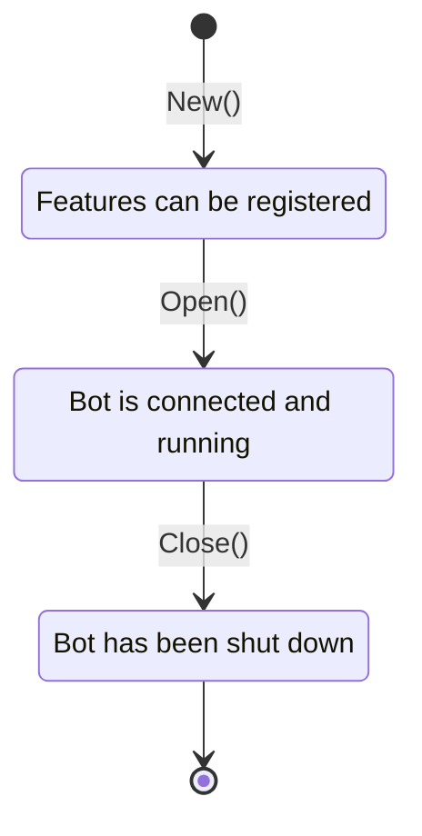

# Discord Bot Framework

A Go framework for building Discord bots with [discordgo](https://github.com/bwmarrin/discordgo). This package provides an event-driven architecture with middleware support, type-safe context wrappers, and fluent reply builders.

## Table of Contents

- [Overview](#overview)
- [Architecture](#architecture)
- [Quick Start](#quick-start)
- [Core Components](#core-components)
  - [Bot](#bot)
  - [EventBus](#eventbus)
  - [Event & EventType](#event--eventtype)
  - [Feature System](#feature-system)
  - [Command](#command)
- [Context Wrappers](#context-wrappers)
- [Reply System](#reply-system)
- [State Management](#state-management)
- [Middleware](#middleware)
- [Quick Reference](#quick-reference)

---

## Overview

This framework abstracts Discord bot development into modular, testable components:

| Component | Purpose |
|-----------|---------|
| **Bot** | Lifecycle management, session handling, feature registration |
| **EventBus** | Pub/sub event dispatching with priority and middleware |
| **Feature** | Self-contained modules with lifecycle hooks |
| **Context** | Type-safe wrappers for different event types |
| **Reply** | Fluent builders for responses, embeds, and modals |
| **StateStore** | Thread-safe key-value storage for features |
| **Middleware** | Reusable request processing (rate limit, permissions, etc.) |

---

## Architecture

### Component Diagram



### Class Diagram

```mermaid
classDiagram
    class Bot {
        -session *discordgo.Session
        -eventBus *EventBus
        -store *StateStore
        -features []Feature
        -commands map[string]*Command
        -state atomic.Int32
        +New(token string, opts ...Option) *Bot
        +RegisterFeature(f Feature) error
        +Open() error
        +Close() error
        +EventBus() *EventBus
        +State() *StateStore
        +Session() *discordgo.Session
        +Logger() logger.Logger
    }

    class Feature {
        <<interface>>
        +Name() string
        +Init(b *Bot) error
        +Shutdown(ctx context.Context) error
        +Subscriptions() []*Subscription
    }

    class CommandProvider {
        <<interface>>
        +Commands() []*Command
    }

    class EventBus {
        -subscriptions map[EventType][]*Subscription
        -middleware []MiddlewareFunc
        +NewEventBus() *EventBus
        +Use(mw ...MiddlewareFunc)
        +Subscribe(sub *Subscription)
        +Publish(e *Event) error
        +Subscriptions(t EventType) []*Subscription
    }

    class Event {
        -typ EventType
        -ctx context.Context
        -session *discordgo.Session
        -data interface{}
        +Type() EventType
        +Context() context.Context
        +Session() *discordgo.Session
        +Data() interface{}
    }

    class Subscription {
        +Type EventType
        +Handler EventHandler
        +Middleware []MiddlewareFunc
        +Priority int
    }

    class Command {
        +Name string
        +Description string
        +Type CommandType
        +Options []*discordgo.ApplicationCommandOption
        +NewSlashCommand(name, desc) *Command
        +WithOptions(opts...) *Command
    }

    class StateStore {
        -data map[string]interface{}
        +Get(key string) interface{}, bool
        +Set(key string, value interface{})
        +Delete(key string)
        +GetOrSet(key string, factory func()) interface{}
    }

    class Context {
        -ctx context.Context
        -session *discordgo.Session
        -event *Event
        -state *StateStore
        +Context() context.Context
        +Session() *discordgo.Session
        +GuildID() string
        +ChannelID() string
        +UserID() string
    }

    class CommandContext {
        +Context
        -interaction *discordgo.InteractionCreate
        -command *Command
        +Option(name string) *cmdOptionValue
        +Defer(ephemeral bool) error
        +Reply() *reply.Builder
    }

    Bot --> EventBus
    Bot --> StateStore
    Bot --> Feature
    Feature <|.. CommandProvider
    EventBus --> Subscription
    Subscription --> Event
    Context --> Event
    Context --> StateStore
    CommandContext --|> Context
```

### Bot Lifecycle Sequence



### Event Flow Sequence



---

## Quick Start

### Minimal Feature Implementation

```go
package myfeature

import (
    "context"

    "github.com/yourusername/mybot/internal/pkg/discord"
    "github.com/bwmarrin/discordgo"
)

type Feature struct {
    bot *discord.Bot
}

func New() *Feature {
    return &Feature{}
}

// Name returns the unique feature identifier.
func (f *Feature) Name() string {
    return "myfeature"
}

// Init is called when the feature is registered.
func (f *Feature) Init(b *discord.Bot) error {
    f.bot = b
    return nil
}

// Shutdown is called when the bot is closing.
func (f *Feature) Shutdown(ctx context.Context) error {
    return nil
}

// Subscriptions returns event handlers for this feature.
func (f *Feature) Subscriptions() []*discord.Subscription {
    return []*discord.Subscription{
        {
            Type:    discord.EventTypeCommand,
            Handler: discord.CommandFilter("hello", f.handleHello),
        },
    }
}

// Commands implements discord.CommandProvider (optional).
func (f *Feature) Commands() []*discord.Command {
    return []*discord.Command{
        discord.NewSlashCommand("hello", "Says hello"),
    }
}

func (f *Feature) handleHello(ctx context.Context, e *discord.Event) error {
    ic := e.Data().(*discordgo.InteractionCreate)
    cmdCtx := discord.NewCommandContext(
        discord.NewContext(e, f.bot.State()),
        ic,
        nil,
    )
    _, err := cmdCtx.Reply().Content("Hello, world!").Send()
    return err
}
```

### Register and Run

```go
func main() {
    bot, _ := discord.New(os.Getenv("DISCORD_TOKEN"))

    bot.RegisterFeature(myfeature.New())

    bot.Open()
    defer bot.Close()

    // Wait for signal...
}
```

---

## Core Components

### Bot

The `Bot` struct is the central coordinator that manages the Discord session, features, and lifecycle.

#### Creation

```go
// Basic creation
bot, err := discord.New("your-token")

// With options
bot, err := discord.New("your-token",
    discord.WithGuildID("123456789"),      // Guild-specific commands (for testing)
    discord.WithLogger(customLogger),       // Custom logger
    discord.WithOnReady(func(s *discordgo.Session, r *discordgo.Ready) {
        fmt.Println("Bot is ready!")
    }),
)
```

#### Options

| Option | Description |
|--------|-------------|
| `WithGuildID(id)` | Register commands to a specific guild (faster for testing) |
| `WithLogger(l)` | Use a custom logger |
| `WithOnReady(fn)` | Callback when bot receives Ready event |
| `WithOnConnect(fn)` | Callback when bot connects |
| `WithOnDisconnect(fn)` | Callback when bot disconnects |
| `WithOnResumed(fn)` | Callback when session resumes |

#### Lifecycle States



#### Key Methods

| Method | Description |
|--------|-------------|
| `RegisterFeature(f)` | Add a feature (must be called before `Open()`) |
| `Open()` | Connect to Discord and sync commands |
| `Close()` | Shutdown features, remove commands, disconnect |
| `EventBus()` | Get the event bus for manual subscriptions |
| `State()` | Get the shared state store |
| `Session()` | Get the underlying discordgo session |

---

### EventBus

The `EventBus` handles event subscription and dispatch with middleware support.

#### How It Works

1. Features register `Subscription`s for specific `EventType`s
2. When Discord sends an event, Bot publishes it to EventBus
3. EventBus runs subscriptions in priority order (lower = first)
4. Each subscription's middleware chain runs before the handler

#### Middleware Execution Order

```
Global Middleware → Subscription Middleware → Handler
```

Middleware wraps from outside-in:

```go
// Registration order: mw1, mw2, mw3
// Execution order:
//   mw1.before → mw2.before → mw3.before → handler → mw3.after → mw2.after → mw1.after
```

#### Global Middleware

```go
bot.EventBus().Use(
    discord.IgnoreBot(),
    middleware.EventLogger(logger),
)
```

---

### Event & EventType

Events wrap Discord data with type information and context.

#### Event Types

| EventType | Discord Event | Data Type |
|-----------|---------------|-----------|
| `EventTypeMessage` | MessageCreate | `*discordgo.MessageCreate` |
| `EventTypeCommand` | InteractionCreate (ApplicationCommand) | `*discordgo.InteractionCreate` |
| `EventTypeComponent` | InteractionCreate (MessageComponent) | `*discordgo.InteractionCreate` |
| `EventTypeModal` | InteractionCreate (ModalSubmit) | `*discordgo.InteractionCreate` |
| `EventTypeVoiceStateUpdate` | VoiceStateUpdate | `*discordgo.VoiceStateUpdate` |
| `EventTypeReactionAdd` | MessageReactionAdd | `*discordgo.MessageReactionAdd` |
| `EventTypeReactionRemove` | MessageReactionRemove | `*discordgo.MessageReactionRemove` |

#### Accessing Event Data

```go
func handler(ctx context.Context, e *discord.Event) error {
    switch e.Type() {
    case discord.EventTypeMessage:
        msg := e.Data().(*discordgo.MessageCreate)
        fmt.Println(msg.Content)

    case discord.EventTypeCommand:
        ic := e.Data().(*discordgo.InteractionCreate)
        cmdName := ic.ApplicationCommandData().Name
    }
    return nil
}
```

---

### Feature System

Features are self-contained modules implementing the `Feature` interface.

#### Feature Interface

```go
type Feature interface {
    Name() string                           // Unique identifier
    Init(b *Bot) error                      // Called on registration
    Shutdown(ctx context.Context) error     // Called on bot close
    Subscriptions() []*Subscription         // Event handlers
}
```

#### CommandProvider Interface (Optional)

```go
type CommandProvider interface {
    Commands() []*Command   // Slash commands to register
}
```

If a feature implements `CommandProvider`, its commands are automatically synced with Discord during `bot.Open()`.

#### Subscription Structure

```go
type Subscription struct {
    Type       EventType           // Which events to receive
    Handler    EventHandler        // func(ctx, event) error
    Middleware []MiddlewareFunc    // Per-subscription middleware
    Priority   int                 // Lower values run first
}
```

#### Filtering Handlers

Use filters to narrow which events a handler processes:

```go
// Only handle /ping command
discord.CommandFilter("ping", f.handlePing)

// Only handle button with specific ID
discord.ComponentFilter("my-button", f.handleButton)
```

---

### Command

Commands define Discord slash commands.

#### Creating Commands

```go
// Simple command
cmd := discord.NewSlashCommand("ping", "Replies with pong")

// Command with options
cmd := discord.NewSlashCommand("echo", "Echoes your message").
    WithOptions(
        &discordgo.ApplicationCommandOption{
            Type:        discordgo.ApplicationCommandOptionString,
            Name:        "text",
            Description: "Text to echo",
            Required:    true,
        },
    )
```

#### Command Types

| Type | Description |
|------|-------------|
| `CommandTypeSlash` | Standard slash command (`/command`) |
| `CommandTypeMessage` | Message context menu |
| `CommandTypeUser` | User context menu |

---

## Context Wrappers

Context wrappers provide type-safe access to event data and helper methods.

### Base Context

All contexts embed the base `Context`:

```go
type Context struct {
    ctx       context.Context
    session   *discordgo.Session
    event     *Event
    state     *StateStore
    responded bool
}
```

| Method | Description |
|--------|-------------|
| `Context()` | Get underlying `context.Context` |
| `Session()` | Get discordgo session |
| `Event()` | Get the raw event |
| `State()` | Get state store |
| `GuildID()` | Get guild ID (empty for DMs) |
| `ChannelID()` | Get channel ID |
| `UserID()` | Get user ID who triggered event |
| `User()` | Get `*discordgo.User` |
| `Member()` | Get `*discordgo.Member` (nil for DMs) |

### CommandContext

For slash command interactions.

```go
func (f *Feature) handleCommand(ctx context.Context, e *discord.Event) error {
    ic := e.Data().(*discordgo.InteractionCreate)
    cmdCtx := discord.NewCommandContext(
        discord.NewContext(e, f.bot.State()),
        ic,
        nil,
    )

    // Read options
    text := cmdCtx.Option("text").String()
    count := cmdCtx.Option("count").Int()
    enabled := cmdCtx.Option("enabled").Bool()

    // Check if option was provided
    if cmdCtx.Option("optional").IsEmpty() {
        // Handle missing option
    }

    // Defer for long operations
    cmdCtx.Defer(true) // true = ephemeral

    // Reply
    _, err := cmdCtx.Reply().Content("Response").Send()
    return err
}
```

| Method | Description |
|--------|-------------|
| `Interaction()` | Raw `*discordgo.InteractionCreate` |
| `Command()` | The `*Command` being executed |
| `Option(name)` | Get option value by name |
| `Defer(ephemeral)` | Send deferred response |
| `Reply()` | Get reply builder |

### MessageContext

For message events.

```go
func (f *Feature) handleMessage(ctx context.Context, e *discord.Event) error {
    msg := e.Data().(*discordgo.MessageCreate)
    msgCtx := discord.NewMessageContext(
        discord.NewContext(e, f.bot.State()),
        msg,
    )

    content := msgCtx.Content()
    msgCtx.Reply("Got it!")
    msgCtx.ReplyEmbed(&discordgo.MessageEmbed{Title: "Hello"})
    msgCtx.Delete() // Delete the original message

    return nil
}
```

| Method | Description |
|--------|-------------|
| `Message()` | Raw `*discordgo.MessageCreate` |
| `Content()` | Message text content |
| `Reply(content)` | Send a message |
| `ReplyEmbed(embed)` | Send an embed |
| `ReplyComplex(data)` | Send complex message |
| `Delete()` | Delete the triggering message |

### ComponentContext

For button/select menu interactions.

```go
func (f *Feature) handleButton(ctx context.Context, e *discord.Event) error {
    ic := e.Data().(*discordgo.InteractionCreate)
    compCtx := discord.NewComponentContext(
        discord.NewContext(e, f.bot.State()),
        ic,
    )

    customID := compCtx.CustomID()
    values := compCtx.Values() // For select menus

    compCtx.Acknowledge() // Silent acknowledgement
    compCtx.Update("Button clicked!") // Update original message
    compCtx.Reply().Content("New message").Ephemeral().Send()

    return nil
}
```

| Method | Description |
|--------|-------------|
| `Interaction()` | Raw interaction |
| `CustomID()` | Component's custom ID |
| `Values()` | Selected values (select menu) |
| `Acknowledge()` | Silent acknowledgement |
| `Update(content)` | Update the message |
| `Reply()` | Get reply builder |

### ModalContext

For modal form submissions.

```go
func (f *Feature) handleModal(ctx context.Context, e *discord.Event) error {
    ic := e.Data().(*discordgo.InteractionCreate)
    modalCtx := discord.NewModalContext(
        discord.NewContext(e, f.bot.State()),
        ic,
    )

    customID := modalCtx.CustomID()
    name := modalCtx.Value("name-input")
    description := modalCtx.Value("description-input")

    _, err := modalCtx.Reply().Content("Form received!").Send()
    return err
}
```

| Method | Description |
|--------|-------------|
| `Interaction()` | Raw interaction |
| `CustomID()` | Modal's custom ID |
| `Value(customID)` | Get text input value by ID |
| `Reply()` | Get reply builder |

### VoiceContext

For voice state updates.

```go
func (f *Feature) handleVoice(ctx context.Context, e *discord.Event) error {
    v := e.Data().(*discordgo.VoiceStateUpdate)
    voiceCtx := discord.NewVoiceContext(
        discord.NewContext(e, f.bot.State()),
        v,
    )

    if voiceCtx.IsJoin() {
        fmt.Printf("User joined channel %s\n", voiceCtx.VoiceChannelID())
    } else if voiceCtx.IsLeave() {
        fmt.Println("User left voice")
    } else if voiceCtx.IsMove() {
        fmt.Println("User moved channels")
    }

    return nil
}
```

| Method | Description |
|--------|-------------|
| `VoiceState()` | Raw `*discordgo.VoiceStateUpdate` |
| `VoiceChannelID()` | Current voice channel (empty if left) |
| `IsJoin()` | User joined a channel |
| `IsLeave()` | User left voice |
| `IsMove()` | User moved between channels |

### ReactionContext

For reaction events.

```go
func (f *Feature) handleReaction(ctx context.Context, e *discord.Event) error {
    r := e.Data().(*discordgo.MessageReactionAdd)
    reactionCtx := discord.NewReactionAddContext(
        discord.NewContext(e, f.bot.State()),
        r,
    )

    messageID := reactionCtx.MessageID()
    emoji := reactionCtx.EmojiName()

    if reactionCtx.IsRemoved() {
        fmt.Println("Reaction was removed")
    }

    return nil
}
```

| Method | Description |
|--------|-------------|
| `MessageID()` | ID of the reacted message |
| `Emoji()` | `*discordgo.Emoji` |
| `EmojiName()` | Emoji name or unicode |
| `IsRemoved()` | True for removal events |
| `ReactionMember()` | Member who reacted (add only) |

---

## Reply System

The `reply` package provides fluent builders for Discord responses.

### Builder

```go
import "github.com/yourusername/mybot/internal/pkg/discord/reply"

// Basic reply
cmdCtx.Reply().Content("Hello!").Send()

// Ephemeral reply
cmdCtx.Reply().Content("Only you can see this").Ephemeral().Send()

// With embed
cmdCtx.Reply().
    Content("Check this out:").
    Embed(reply.NewEmbed().
        Title("My Embed").
        Description("Description here").
        Color(0x00FF00),
    ).
    Send()

// With components
cmdCtx.Reply().
    Content("Click a button:").
    Components(
        discordgo.ActionsRow{
            Components: []discordgo.MessageComponent{
                discordgo.Button{
                    Label:    "Click Me",
                    CustomID: "my-button",
                    Style:    discordgo.PrimaryButton,
                },
            },
        },
    ).
    Send()

// With attachment
cmdCtx.Reply().
    Content("Here's a file:").
    Attachment("data.txt", strings.NewReader("file contents")).
    Send()

// Update message (for component interactions)
compCtx.Reply().Content("Updated!").UpdateMessage().Send()
```

| Method | Description |
|--------|-------------|
| `Content(s)` | Set text content |
| `Embed(e)` | Add embed (using builder) |
| `RawEmbed(e)` | Add raw `*discordgo.MessageEmbed` |
| `Attachment(name, reader)` | Add file attachment |
| `Ephemeral()` | Make visible only to user |
| `Spoiler()` | Wrap content in spoiler tags |
| `Components(c...)` | Add message components |
| `NoMentions()` | Disable mention parsing |
| `UpdateMessage()` | Update original (components) |
| `Send()` | Send and return `*SentMessage` |
| `Modal(m)` | Send a modal dialog |

### Embed Builder

```go
embed := reply.NewEmbed().
    Title("Title").
    Description("Description").
    URL("https://example.com").
    Color(0xFF5733).
    Field("Field 1", "Value 1", true).
    Field("Field 2", "Value 2", true).
    Thumbnail("https://example.com/thumb.png").
    Image("https://example.com/image.png").
    Author("Author Name", "https://author.url", "https://icon.url").
    Footer("Footer text", "https://footer-icon.url").
    Timestamp("2024-01-01T00:00:00Z")

cmdCtx.Reply().Embed(embed).Send()
```

### Modal Builder

```go
modal := reply.NewModal("feedback-modal", "Give Feedback").
    ShortTextInput("name", "Your Name",
        reply.WithPlaceholder("Enter your name"),
        reply.WithRequired(true),
    ).
    ParagraphTextInput("feedback", "Your Feedback",
        reply.WithPlaceholder("Tell us what you think..."),
        reply.WithMinLength(10),
        reply.WithMaxLength(1000),
    )

cmdCtx.Reply().Modal(modal)
```

| Method | Description |
|--------|-------------|
| `ShortTextInput(id, label, opts...)` | Single-line input |
| `ParagraphTextInput(id, label, opts...)` | Multi-line input |
| `TextInput(id, label, style, opts...)` | Generic text input |

**TextInput Options:**
- `WithPlaceholder(s)` - Placeholder text
- `WithValue(s)` - Pre-filled value
- `WithMinLength(n)` - Minimum length
- `WithMaxLength(n)` - Maximum length
- `WithRequired(b)` - Required field

### SentMessage

After sending, you get a `SentMessage` for further operations:

```go
sent, err := cmdCtx.Reply().Content("Initial").Send()

// Edit
sent.Edit("Updated content")
sent.EditEmbed(&discordgo.MessageEmbed{Title: "New embed"})

// React
sent.React("👍")
sent.RemoveReaction("👍")

// Delete
sent.Delete()

// Get info
msgID := sent.ID()
channelID := sent.ChannelID()
msg := sent.Message()
```

---

## State Management

### StateStore

Thread-safe key-value storage for sharing state across features.

```go
store := bot.State()

// Basic operations
store.Set("key", "value")
value, ok := store.Get("key")
store.Delete("key")

// Atomic get-or-create
counter := store.GetOrSet("counter", func() interface{} {
    return 0
}).(int)

// Utilities
keys := store.Keys()
count := store.Len()
store.Clear()
```

### ScopedState

Namespaced view of StateStore to avoid key collisions:

```go
func (f *Feature) Init(b *discord.Bot) error {
    // Create scoped state for this feature
    f.state = discord.NewScopedState(b.State(), "myfeature")
    return nil
}

func (f *Feature) doSomething() {
    // Keys are automatically prefixed with "myfeature:"
    f.state.Set("counter", 0)        // Actually stores "myfeature:counter"
    val, _ := f.state.Get("counter") // Gets "myfeature:counter"
}
```

---

## Middleware

Middleware intercepts events before handlers, enabling cross-cutting concerns.

### Signature

```go
type MiddlewareFunc func(ctx context.Context, e *Event, next func() error) error
```

- Call `next()` to continue the chain
- Return an error to halt execution
- Return `nil` without calling `next()` to silently drop the event

### Core Middleware

Located in the main `discord` package:

```go
import "github.com/yourusername/mybot/internal/pkg/discord"

// Skip events from bot users
discord.IgnoreBot()

// Only process guild events (no DMs)
discord.RequireGuild()

// Combine multiple middleware
discord.Chain(mw1, mw2, mw3)
```

### Extended Middleware

Located in `discord/middleware` package:

```go
import "github.com/yourusername/mybot/internal/pkg/discord/middleware"
```

#### Rate Limiting

```go
// 5 requests per 10 seconds per user
middleware.RateLimit(5, 10*time.Second)
```

Exceeded requests receive an ephemeral "You're doing that too fast" message.

#### NSFW Channel Requirement

```go
middleware.RequireNSFW()
```

Non-NSFW channels receive an ephemeral error message.

#### Event Logging

```go
middleware.EventLogger(logger)
```

Logs event type, user, channel, guild, duration, and errors.

#### Permission Checking

```go
// Create checker
checker := middleware.NewHybridPermissionChecker(config)

// Require specific permission
middleware.RequireEventPermission(checker, "admin")

// Require any of multiple permissions
middleware.RequireAnyEventPermission(checker, "admin", "moderator")
```

Checks config first (`discord.permissions.<user_id>: [permissions]`), then falls back to Discord role names.

#### Content Filtering

```go
middleware.ContentFilterMiddleware(middleware.ContentFilterConfig{
    Filters: []middleware.ContentFilter{
        middleware.WordFilter("badword1", "badword2"),
        middleware.InviteFilter(),           // Block Discord invites
        middleware.LinkFilter(),             // Block all URLs
        middleware.MentionSpamFilter(5),     // Max 5 mentions
        middleware.CapsFilter(0.7, 10),      // 70% caps, min 10 chars
        middleware.RegexFilter(regexp.MustCompile(`pattern`)),
    },
    Action:  middleware.FilterActionWarn,    // Delete + warn
    Message: "Your message was removed.",
})
```

**Filter Actions:**
- `FilterActionDelete` - Silent deletion
- `FilterActionWarn` - Delete and send warning
- `FilterActionBlock` - Delete only

### Custom Middleware

```go
func MyMiddleware() discord.MiddlewareFunc {
    return func(ctx context.Context, e *discord.Event, next func() error) error {
        // Before handler
        start := time.Now()

        // Continue chain
        err := next()

        // After handler
        duration := time.Since(start)
        fmt.Printf("Handler took %v\n", duration)

        return err
    }
}
```

### Applying Middleware

**Global (all events):**

```go
bot.EventBus().Use(
    discord.IgnoreBot(),
    middleware.RateLimit(10, time.Minute),
)
```

**Per-subscription:**

```go
func (f *Feature) Subscriptions() []*discord.Subscription {
    return []*discord.Subscription{
        {
            Type:    discord.EventTypeCommand,
            Handler: discord.CommandFilter("admin", f.handleAdmin),
            Middleware: []discord.MiddlewareFunc{
                middleware.RequireEventPermission(checker, "admin"),
            },
        },
    }
}
```

---

## Quick Reference

### Event Types

| Type | Description | Data |
|------|-------------|------|
| `EventTypeMessage` | New message | `*discordgo.MessageCreate` |
| `EventTypeCommand` | Slash command | `*discordgo.InteractionCreate` |
| `EventTypeComponent` | Button/select | `*discordgo.InteractionCreate` |
| `EventTypeModal` | Modal submit | `*discordgo.InteractionCreate` |
| `EventTypeVoiceStateUpdate` | Voice change | `*discordgo.VoiceStateUpdate` |
| `EventTypeReactionAdd` | Reaction added | `*discordgo.MessageReactionAdd` |
| `EventTypeReactionRemove` | Reaction removed | `*discordgo.MessageReactionRemove` |

### Context Methods Quick Reference

| Context | Key Methods |
|---------|-------------|
| `Context` | `GuildID()`, `ChannelID()`, `UserID()`, `User()`, `Member()` |
| `CommandContext` | `Option(name)`, `Defer(ephemeral)`, `Reply()` |
| `MessageContext` | `Content()`, `Reply(s)`, `ReplyEmbed(e)`, `Delete()` |
| `ComponentContext` | `CustomID()`, `Values()`, `Acknowledge()`, `Update(s)`, `Reply()` |
| `ModalContext` | `CustomID()`, `Value(id)`, `Reply()` |
| `VoiceContext` | `VoiceChannelID()`, `IsJoin()`, `IsLeave()`, `IsMove()` |
| `ReactionContext` | `MessageID()`, `EmojiName()`, `IsRemoved()` |

### Reply Builder Methods

| Method | Description |
|--------|-------------|
| `Content(s)` | Text content |
| `Embed(e)` | Add embed builder |
| `RawEmbed(e)` | Add raw embed |
| `Attachment(name, r)` | Add file |
| `Ephemeral()` | Only visible to user |
| `Spoiler()` | Wrap in spoiler |
| `Components(c...)` | Add buttons/selects |
| `NoMentions()` | Disable pings |
| `UpdateMessage()` | Update original |
| `Send()` | Send response |
| `Modal(m)` | Send modal |

### Middleware Functions

| Function | Package | Description |
|----------|---------|-------------|
| `IgnoreBot()` | `discord` | Skip bot users |
| `RequireGuild()` | `discord` | Guild-only |
| `Chain(mw...)` | `discord` | Combine middleware |
| `RateLimit(n, d)` | `middleware` | Rate limiting |
| `RequireNSFW()` | `middleware` | NSFW channels only |
| `EventLogger(l)` | `middleware` | Log events |
| `RequireEventPermission(c, p)` | `middleware` | Permission check |
| `ContentFilterMiddleware(cfg)` | `middleware` | Filter messages |

---

## File Structure

```
discord/
├── bot.go          # Bot core, lifecycle, feature registration
├── event.go        # EventBus, Event, Subscription, EventType
├── feature.go      # Feature interface, CommandProvider, filters
├── command.go      # Command type definition
├── ctx.go          # All context wrappers
├── middleware.go   # Core middleware (IgnoreBot, RequireGuild, Chain)
├── state.go        # StateStore, ScopedState
├── testing.go      # Test helpers (NewTestBot, etc.)
├── middleware/     # Extended middleware
│   ├── content.go      # Content filtering
│   ├── logger.go       # Event logging
│   ├── nsfw.go         # NSFW channel check
│   ├── permission.go   # Permission checking
│   └── ratelimit.go    # Rate limiting
└── reply/          # Reply builder system
    ├── builder.go      # Main reply builder
    ├── embed.go        # Embed builder
    ├── modal.go        # Modal builder
    └── sent.go         # SentMessage operations
```

